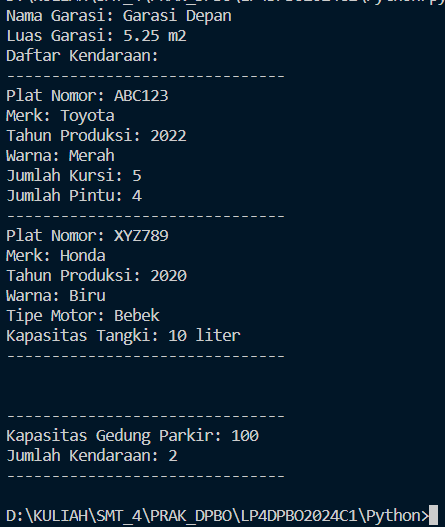

# Latihan Praktikum 4 DPBO

## Janji

Saya Ahmad Taufiq Hidayat dengan NIM 2202074 mengerjakan LP2
dalam mata kuliah DPBO untuk keberkahanNya maka saya tidak
melakukan kecurangan seperti yang telah dispesifikasikan. Aamiin.

## Data Diri

- 2202074
- Ahmad Taufiq Hidayat
- Ilmu Komputer C1'22
- Universitas Pendidikan Indonesia

## Penjelasan Kode Program

Program yang saya buat merupakan implementasi sederhana dari Pemrograman Berorientasi Objek (OOP) menggunakan C++ dan Python. Program ini berfokus pada tiga konsep utama: inheritance, composition, dan array of objects. Program ini mendefinisikan beberapa kelas untuk memodelkan berbagai aspek kendaraan dan sistem garasi.

Kelas-Kelas :

Vehicle
Atribut: plat nomor, merk, tahun produksi, warna

Car
Atribut: jumlah kursi, jumlah pintu
Mewarisi dari: Vehicle

Motorcycle
Atribut: jenis motor, kapasitas tangki
Mewarisi dari: Vehicle

Garage
Atribut: nama garasi, luas garasi, daftar kendaraan
Komposisi: Menampung array objek Vehicle

ParkingLot
Atribut: kapasitas, jumlah kendaraan saat ini
Komposisi: Menampung array objek Vehicle

## contoh menjalankan program menggunakan Python :

